# Guía de uso: Disponibilidad gestionada

*Guía ilustrada para profesores editores y responsables de curso. Todas las
capturas proceden del funcionamiento real del plugin en el curso ficticio
“Learning Pathways — Managed Availability Demo”.*

También disponible [en inglés](user_guide.md).

Disponibilidad gestionada permite decidir desde un único panel quién puede
acceder a cada sección, actividad y recurso: toda la clase, uno o varios
grupos, alumnos concretos o nadie.

> **Idea fundamental:** el plugin añade una condición más. No elimina ni
> evita fechas, calificaciones, finalización, agrupamientos, visibilidad u
> otras restricciones normales de Moodle.

## 1. Activar la gestión en un curso

Un usuario con el permiso `availability/managed:configure` abre
**Más → Configuración de Disponibilidad gestionada**. Al activar puede:

- mantener inicialmente abierto todo el contenido, opción segura para un
  curso que ya se está utilizando;
- comenzar con todo cerrado y preparar la apertura desde cero.

Una vez activado, esta pantalla muestra el estado del curso y un acceso
directo al panel de gestión.

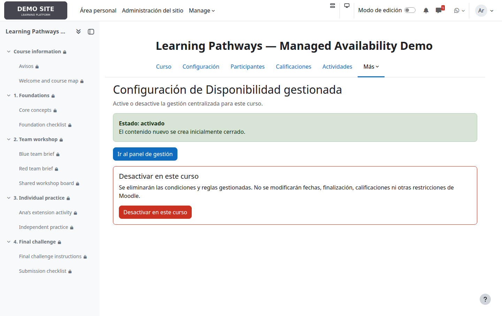

Desactivar un curso elimina sus condiciones y reglas gestionadas. No debe
confundirse con la suspensión global del administrador, que solo deja las
reglas temporalmente sin efecto y las conserva.

## 2. Entender el panel

El panel conserva la jerarquía del curso: cada tarjeta representa una
sección y, cuando procede, debajo aparecen sus actividades. Los botones del
encabezado muestran el estado actual y ofrecen acciones rápidas.

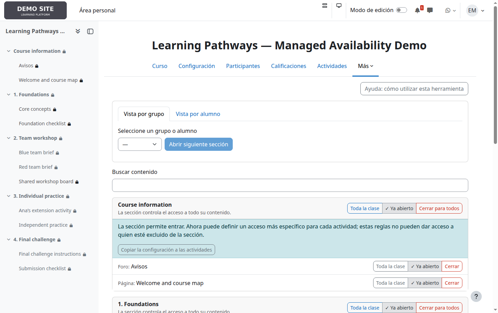

- **Toda la clase**, **Grupos: N** o **Alumnos: N** abre el editor completo.
- **Abrir para toda la clase** sustituye los destinatarios actuales por toda
  la clase.
- **Cerrar para todos** elimina todos los destinatarios gestionados.
- Una acción ya satisfecha aparece en gris, marcada y deshabilitada.

Estas acciones se aplican inmediatamente.

## 3. Sección cerrada: su contenido no es accesible

Una sección está cerrada cuando no tiene ningún destinatario. En ese caso
Moodle impide llegar a todo lo que contiene, por lo que el panel oculta los
controles de sus actividades y muestra una única explicación.

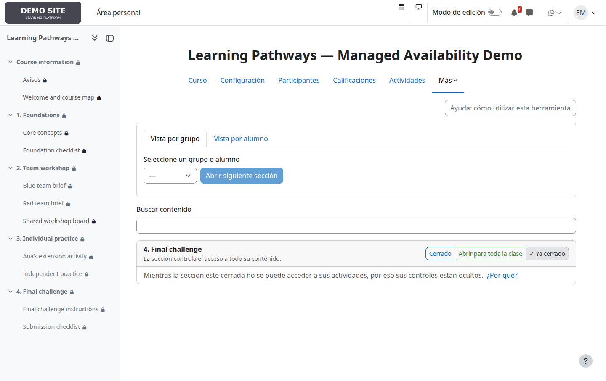

Las reglas interiores no se eliminan: permanecen guardadas y reaparecen al
volver a abrir la sección.

## 4. Sección abierta: reglas más específicas dentro

La sección **2. Team workshop** permite entrar a Blue team y Red team. Por
eso se muestran sus actividades:

- *Blue team brief* solo admite a Blue team;
- *Red team brief* solo admite a Red team;
- *Shared workshop board* está abierta para toda la clase que ya pueda
  entrar en la sección.

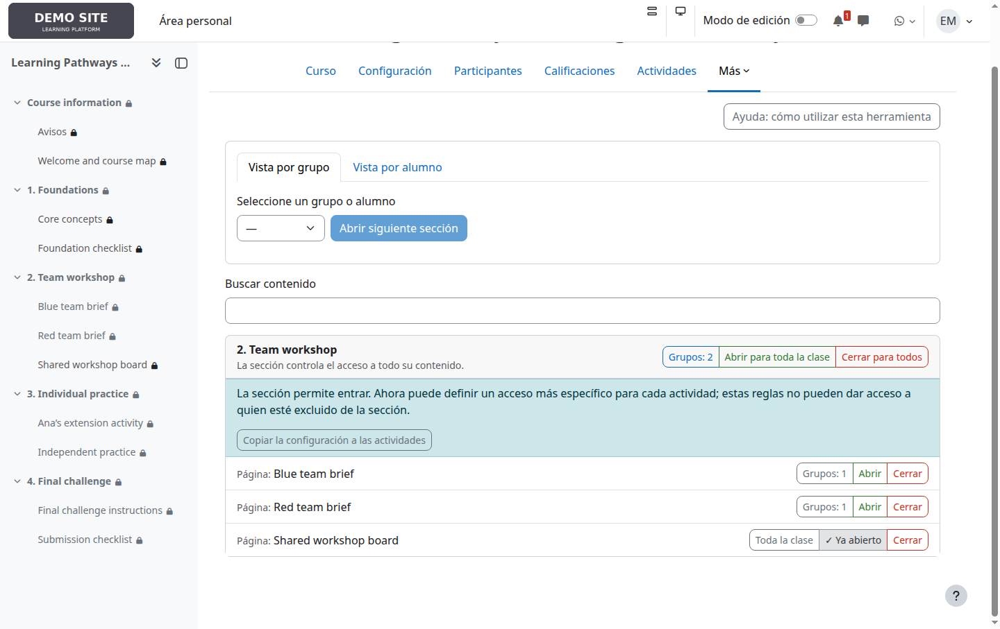

El acceso efectivo siempre combina ambos niveles:

```text
acceso a la sección Y acceso a la actividad
```

Una actividad puede restringir más, pero nunca dar entrada a un alumno
excluido por la sección.

## 5. Elegir destinatarios

Pulse el botón que muestra el estado de una sección o actividad. En el
diálogo puede seleccionar:

- **Toda la clase**;
- uno o varios grupos;
- uno o varios alumnos concretos.

Grupos y alumnos se combinan con **O**: basta pertenecer a uno de los grupos
elegidos o estar seleccionado individualmente.

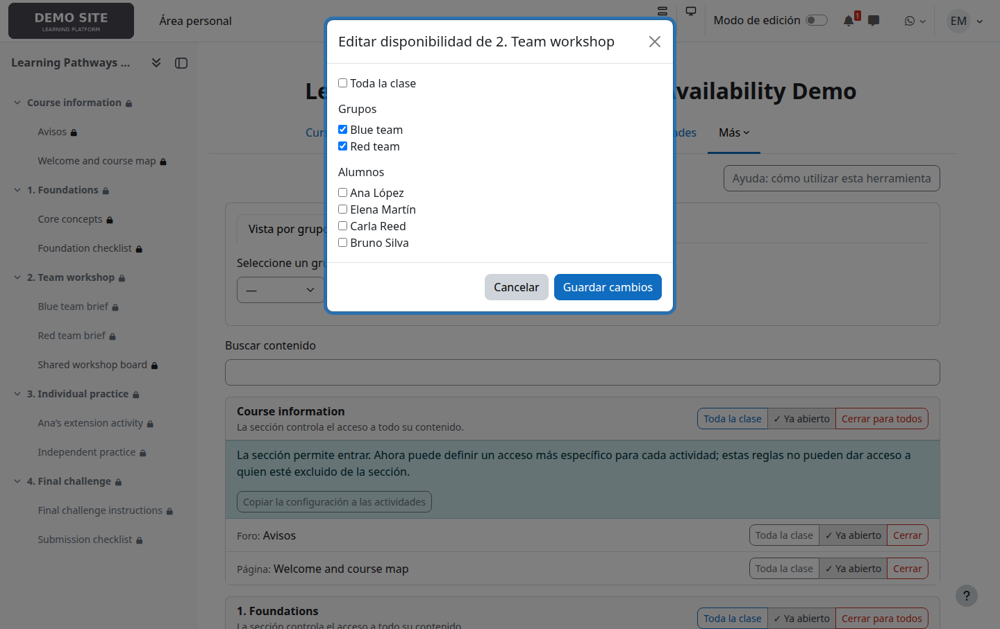

La pertenencia a grupos se consulta en Moodle en cada acceso. Si un alumno
cambia de grupo, el resultado cambia sin tener que rehacer la regla.

## 6. Copiar una sección a sus actividades

**Copiar la configuración a las actividades** reemplaza, tras confirmación,
la regla gestionada de todas las actividades de esa sección por la regla
actual de la sección.

Es una copia puntual, no una herencia ni una sincronización. Los cambios
posteriores en la sección no modifican automáticamente sus actividades.
Utilícela cuando realmente quiera igualarlas; no es necesaria para cerrar
el contenido de una sección cerrada.

## 7. Revisar el recorrido de un grupo o alumno

La **Vista por grupo** resume qué secciones están abiertas para el grupo
seleccionado. **Abrir siguiente sección** abre manualmente la primera que
todavía esté cerrada para ese grupo.

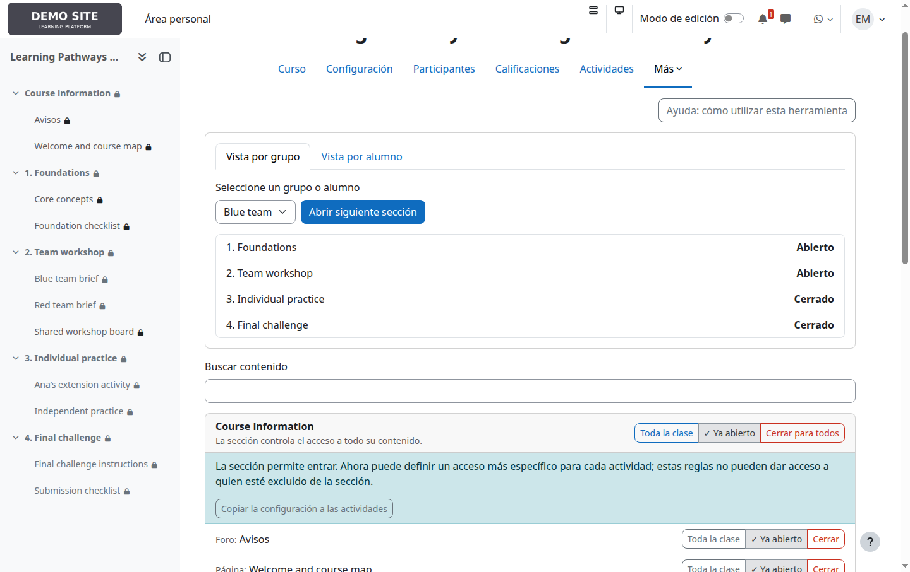

La **Vista por alumno** ofrece la misma revisión para una persona concreta.
La progresión es manual: no consulta calificaciones ni finalización.

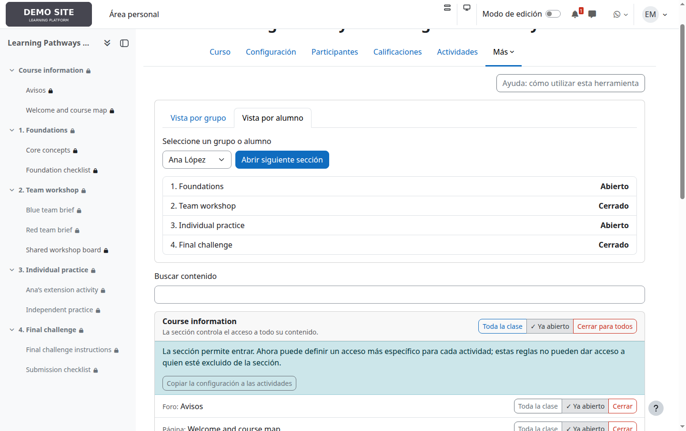

## 8. Comprobar la experiencia del alumno

Ana pertenece a Blue team y además tiene acceso individual a la sección de
práctica. Bruno pertenece a Red team. Sus páginas de curso muestran
resultados diferentes a partir de las mismas reglas.

| Ana López | Bruno Silva |
|---|---|
| 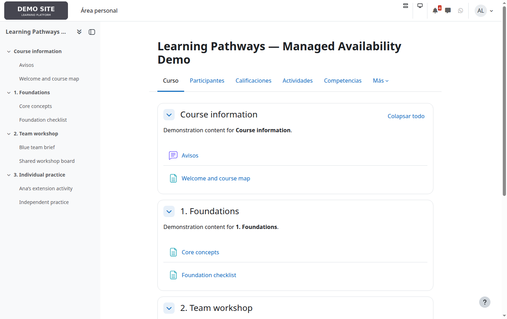 | 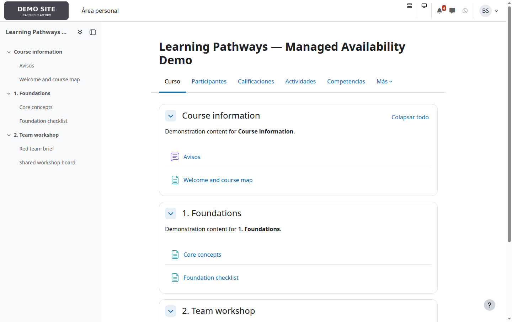 |

Esta comprobación con cuentas de alumno es recomendable cuando se combinan
reglas de sección, actividad y otras restricciones de Moodle.

## 9. Consultar la ayuda integrada

El enlace **Ayuda: cómo utilizar esta herramienta** explica destinatarios,
acciones rápidas, copia, progresión y las precauciones más importantes sin
abandonar el contexto del curso.

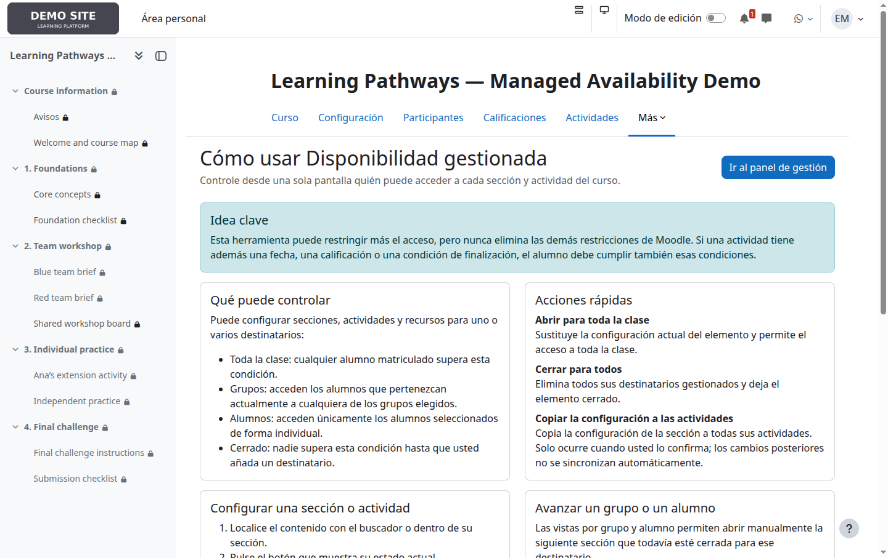

## 10. Consultar el historial

Los usuarios con `availability/managed:viewaudit` pueden revisar quién
realizó cada cambio, cuándo, sobre qué elemento y el estado anterior y
nuevo. El historial es especialmente útil después de acciones masivas o al
investigar un acceso inesperado.

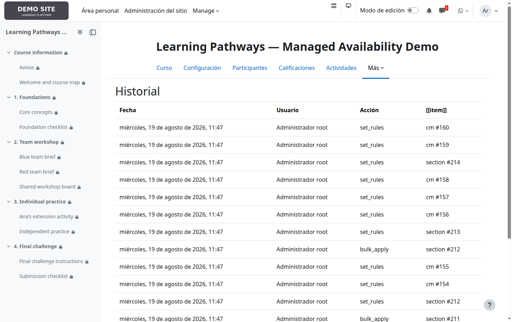

## Situaciones habituales

| Objetivo | Configuración recomendada |
|---|---|
| Abrir una unidad a todos | Abra la sección para toda la clase. Mantenga abiertas las actividades salvo que alguna necesite una excepción. |
| Liberar una unidad por equipos | Seleccione los grupos en la sección. Configure actividades individuales solo cuando los equipos deban ver materiales diferentes. |
| Dar acceso excepcional | Añada al alumno en la sección y, si corresponde, también en la actividad restringida. |
| Ocultar completamente una unidad | Cierre la sección. No es necesario cerrar una por una sus actividades. |
| Igualar todas las actividades | Configure la sección y use **Copiar la configuración a las actividades**, sabiendo que es una sustitución puntual. |
| Pausar el producto en todo el sitio | Use el interruptor global de administración. Las reglas se conservan y dejan de restringir temporalmente. |

## Antes de terminar

- Compruebe primero quién puede entrar en la sección.
- Recuerde que una actividad nunca puede ampliar el acceso de su sección.
- Revise otras restricciones Moodle si un alumno autorizado sigue sin poder
  entrar.
- Use las vistas por grupo o alumno y, para casos importantes, compruebe el
  curso con una cuenta de alumno.
- No desactive el plugin en el curso para “pausarlo”: esa acción elimina sus
  reglas. Para una pausa reversible existe el interruptor global.

---

Las imágenes de esta guía son capturas reales, no maquetas. El conjunto
ficticio puede regenerarse con `docs/fixtures/create_user_guide.php` y las
capturas con `docs/fixtures/capture_user_guide.py` en la instalación local
de pruebas.
