# User Guide: Managed Availability

*An illustrated guide for editing teachers and course managers. Every
screenshot shows the plugin's real behavior in the fictional “Learning
Pathways — Managed Availability Demo” course.*

También disponible [en español](user_guide.es.md).

Managed Availability provides one dashboard for deciding who may access
each section, activity, and resource: the whole class, one or more groups,
specific students, or nobody.

> **Key idea:** the plugin adds one more condition. It never removes or
> bypasses dates, grades, completion, groupings, visibility, or other normal
> Moodle restrictions.

## 1. Enable management in a course

A user with `availability/managed:configure` opens **More → Managed
availability configuration**. On activation they can:

- keep all existing content initially open, the safe option for a course
  already in use;
- start with everything closed and prepare release from scratch.

Once enabled, this screen shows the course state and provides a direct link
to the management dashboard.

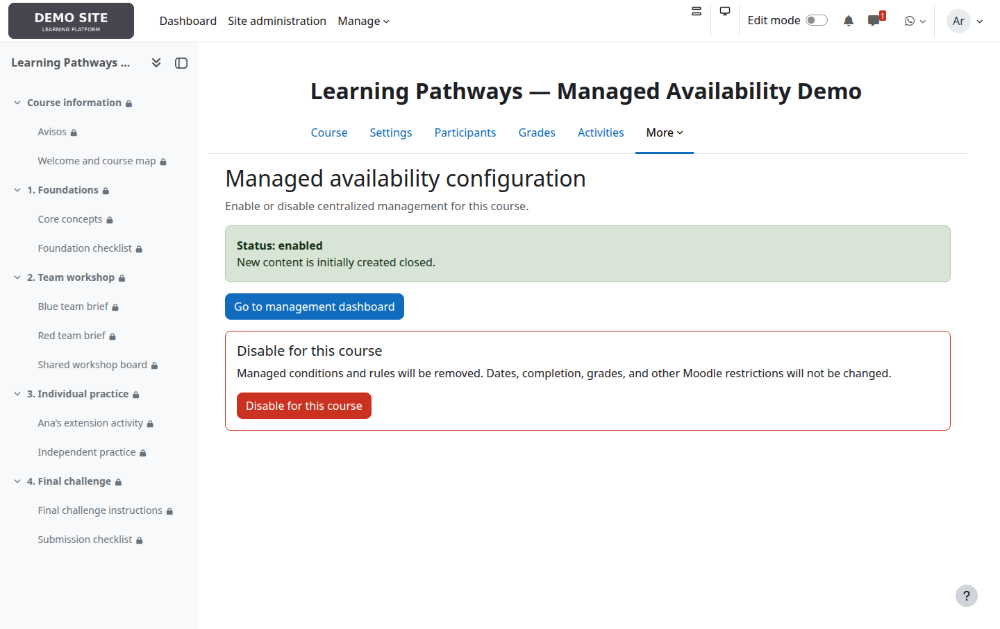

Disabling a course removes its managed conditions and rules. Do not confuse
this with the administrator's global suspension, which temporarily bypasses
rules while retaining them.

## 2. Understand the dashboard

The dashboard preserves the course hierarchy: each card represents a
section and, when appropriate, its activities appear underneath. Header
buttons show the current state and provide quick actions.

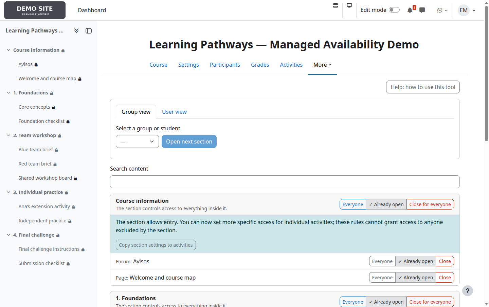

- **Everyone**, **Groups: N**, or **Users: N** opens the full editor.
- **Open for everyone** replaces the current targets with the whole class.
- **Close for everyone** removes all managed targets.
- An already satisfied action is grey, marked, and disabled.

These actions take effect immediately.

## 3. Closed section: its content cannot be reached

A section is closed when it has no target. Moodle then prevents access to
everything inside it, so the dashboard hides its activity controls and
shows one explanation.

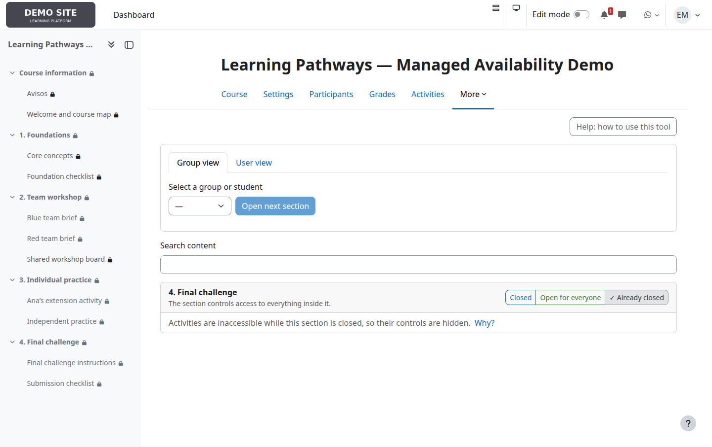

Inner rules are not deleted: they remain stored and reappear when the
section is opened again.

## 4. Open section: more specific rules inside

Section **2. Team workshop** admits both Blue team and Red team. Its
activities are therefore visible in the dashboard:

- *Blue team brief* admits only Blue team;
- *Red team brief* admits only Red team;
- *Shared workshop board* is open to everyone who can already enter the
  section.

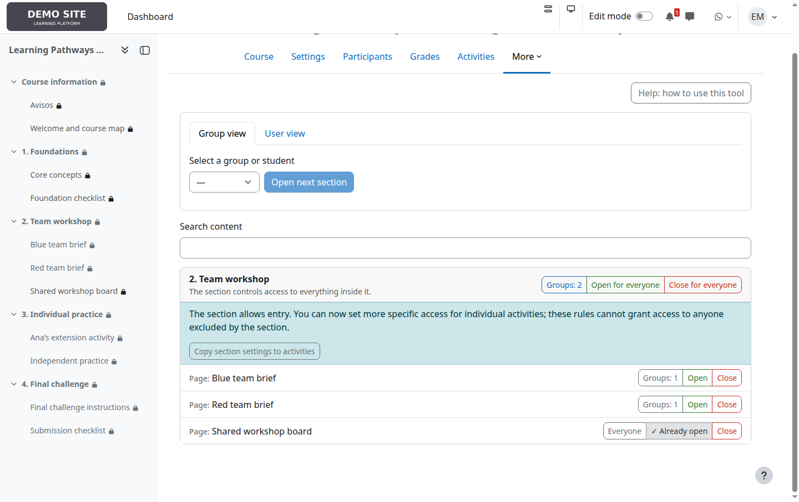

Effective access always combines both levels:

```text
section access AND activity access
```

An activity can restrict access further, but it can never admit a student
excluded by its section.

## 5. Select targets

Select the button showing a section or activity's state. In the dialog you
can choose:

- **Everyone**;
- one or more groups;
- one or more specific students.

Groups and students are combined with **OR**: membership of any selected
group or an individual selection is enough.

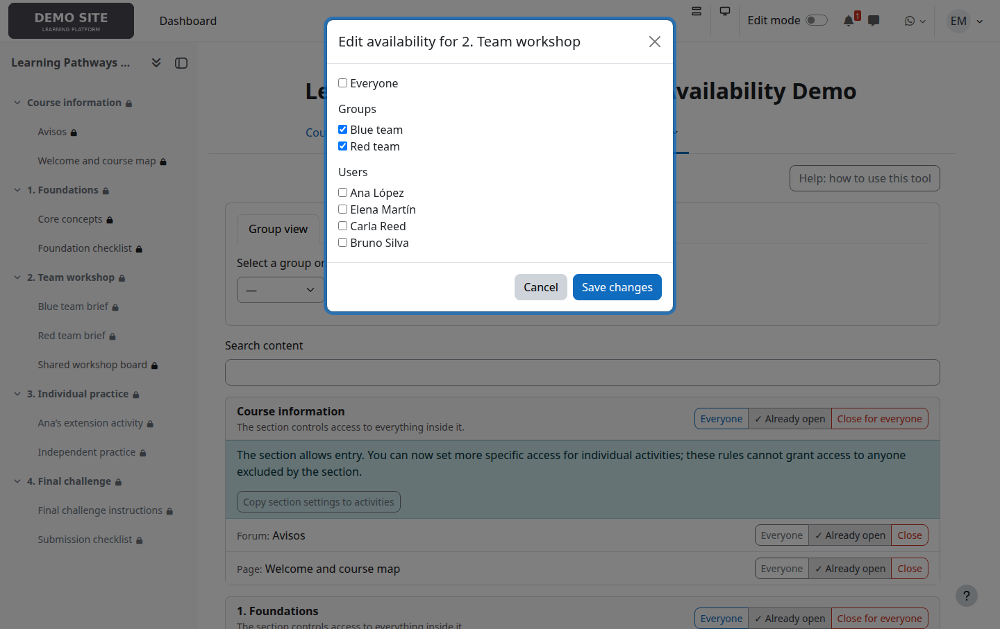

Group membership is read from Moodle on every access. Moving a student to
another group changes the result without rebuilding the rule.

## 6. Copy a section to its activities

**Copy section settings to activities** replaces, after confirmation, every
activity's managed rule in that section with the section's current rule.

This is a one-time copy, not inheritance or synchronization. Later section
changes do not modify its activities automatically. Use it only when you
really want the rules to match; it is not needed to block the content of a
closed section.

## 7. Review a group or student's pathway

**Group view** summarizes which sections are open for the selected group.
**Open next section** manually opens the first section still closed for that
group.

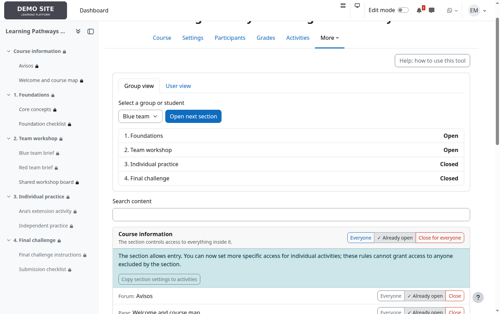

**User view** provides the same review for one person. Progression is
manual: it does not inspect grades or completion.

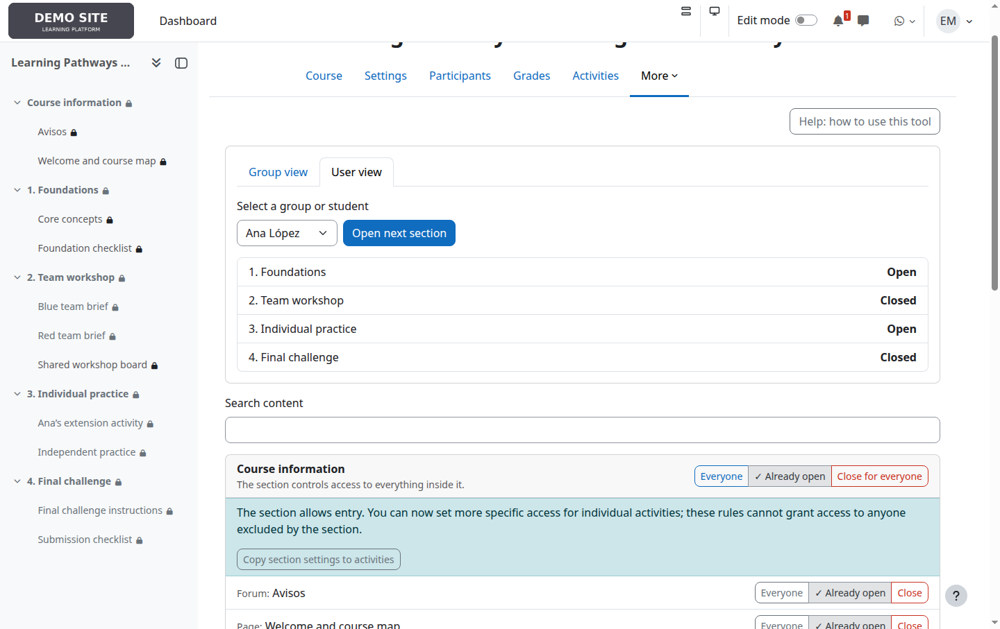

## 8. Check the student experience

Ana belongs to Blue team and also has individual access to the practice
section. Bruno belongs to Red team. Their course pages show different
results from the same rule set.

| Ana López | Bruno Silva |
|---|---|
| 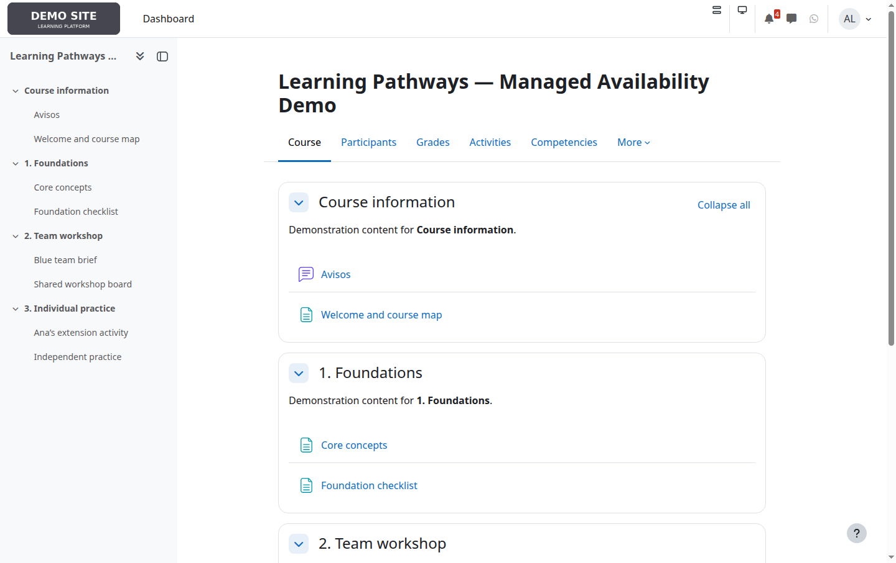 | 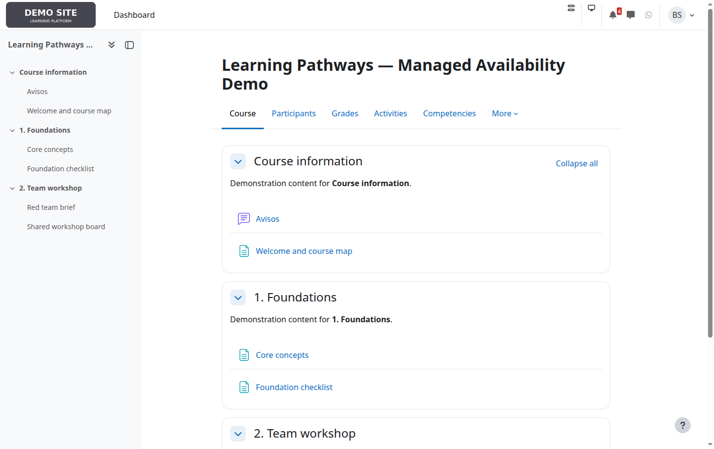 |

Checking with student accounts is recommended whenever section, activity,
and other Moodle restrictions are combined.

## 9. Use the integrated help

**Help: how to use this tool** explains targets, quick actions, copying,
progression, and the main precautions without leaving the course context.

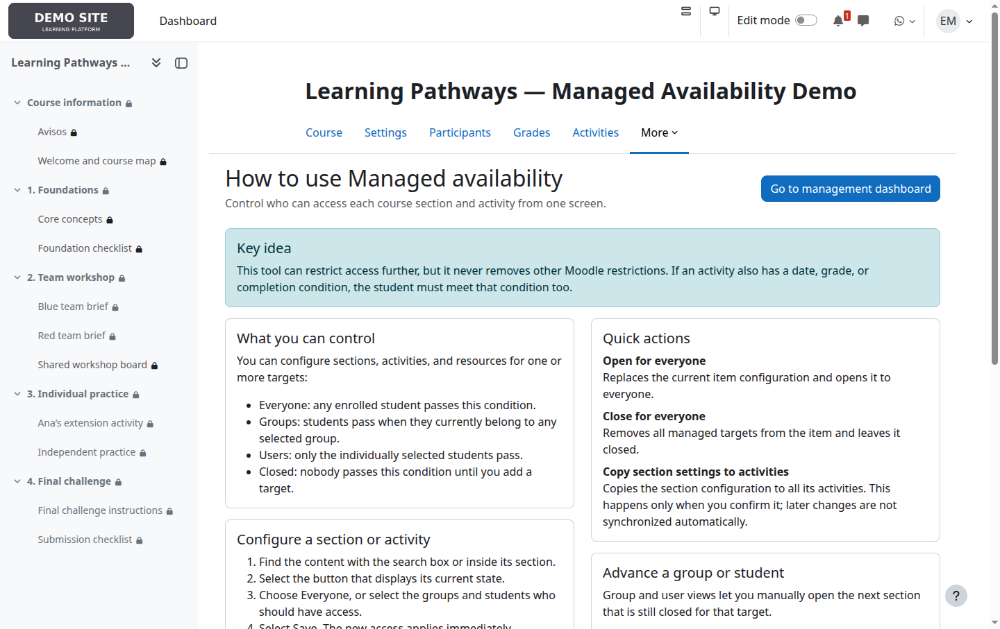

## 10. Review the audit log

Users with `availability/managed:viewaudit` can inspect who made each
change, when, on which item, and the previous and new states. The log is
particularly useful after bulk actions or when investigating unexpected
access.

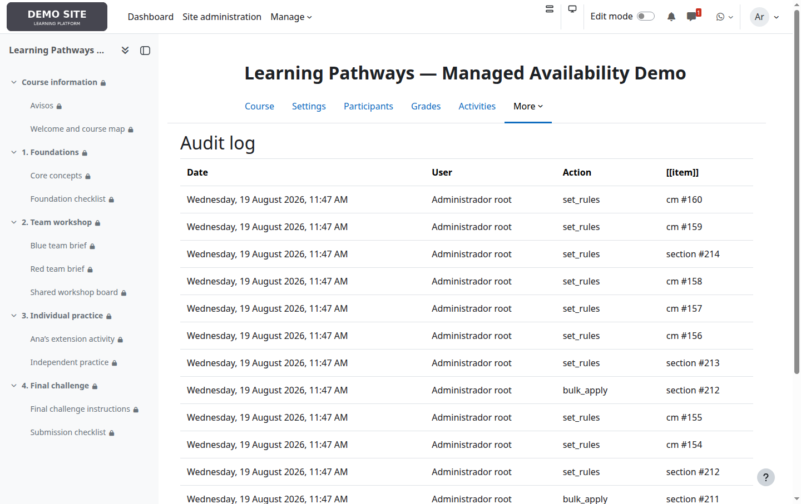

## Common situations

| Goal | Recommended configuration |
|---|---|
| Open a unit to everyone | Open the section to everyone. Keep activities open unless one needs an exception. |
| Release a unit by teams | Select the groups on the section. Configure individual activities only when teams need different materials. |
| Grant exceptional access | Add the student to the section and, when applicable, to the restricted activity as well. |
| Hide a whole unit | Close the section. There is no need to close each activity separately. |
| Make all activities match | Configure the section and use **Copy section settings to activities**, knowing it is a one-time replacement. |
| Pause the product site-wide | Use the global administration switch. Rules are retained and temporarily stop restricting access. |

## Before you finish

- Check first who can enter the section.
- Remember that an activity can never broaden its section's access.
- Review other Moodle restrictions if an authorized student still cannot
  enter.
- Use group or user views and, for important cases, verify the course with a
  student account.
- Do not disable the plugin in a course merely to pause it: that action
  deletes its rules. Use global suspension for a reversible pause.

---

The images in this guide are real screenshots, not mockups. The fictional
dataset can be rebuilt with `docs/fixtures/create_user_guide.php`, and the
screenshots with `docs/fixtures/capture_user_guide.py`, in the local test
installation.
